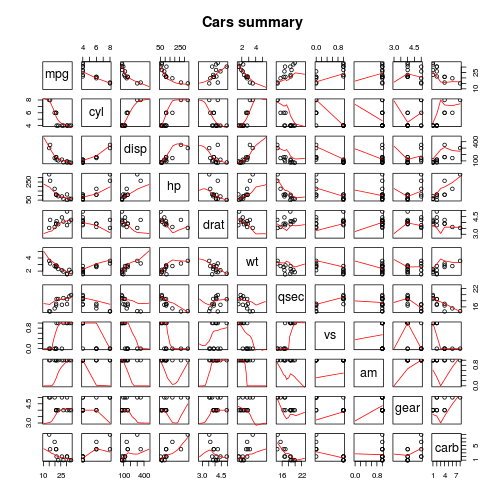
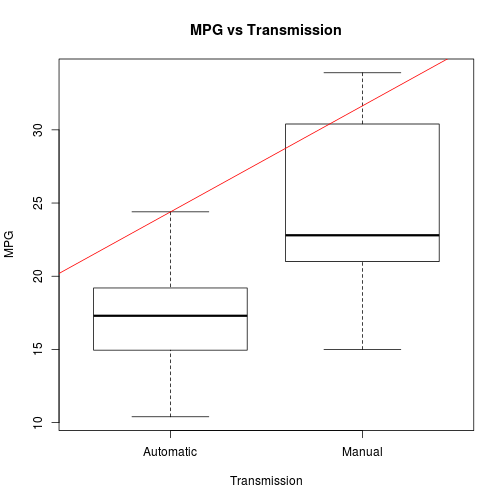
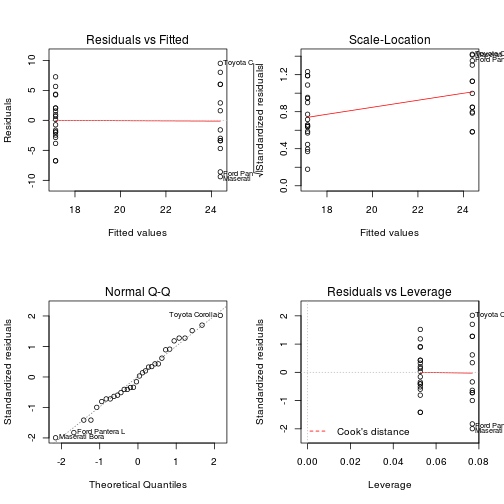
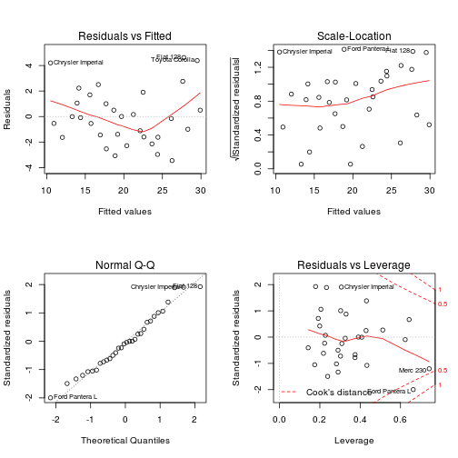
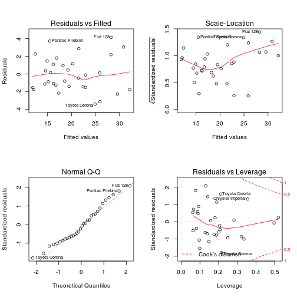

Relationship between a set of variables and miles per gallon
========================================================

## Summary
You work for Motor Trend, a magazine about the automobile industry. Looking at a data set of a collection of cars, they are interested in exploring the relationship between a set of variables and miles per gallon (MPG) (outcome). They are particularly interested in the following two questions:

- Is an automatic or manual transmission better for MPG
- Quantify the MPG difference between automatic and manual transmissions

The data was extracted from the 1974 Motor Trend US magazine, and comprises fuel consumption and 10 aspects of automobile design and performance for 32 automobiles (1973–74 models).

We are interested in two question: "Is an automatic or manual transmission better for MPG?" and "Quantifying how different is the MPG between automatic and manual transmissions?" 
I used some basic data wrangling and regression models to answer the questions. 
After the data analysis I can say there is a significant relationship between the fuel consumption and the transmission type so the manual transmission is better for MPG. 
After inspect other variables I found two cofounding variables 'weight' and 'quarter-mile time'. With these variables we can model what varable values can produce the best Mpg.


### Loading the dataset

```r
data(mtcars)
```
### Description for the mtcars dataset

```r
?mtcars
```
### Converting transmission values to factors

```r
cars<-transform(mtcars, am=factor(am))
levels(cars$am)[1] <- "Automatic"
levels(cars$am)[2] <- "Manual"
```
### Calculating the mean of each transmission types

```r
automean<-mean(cars$mpg[cars$am=="Automatic"])
manualmean<-mean(cars$mpg[cars$am=="Manual"])
```
The mean for manual transmission is 24.3923 mpg and 17.1474 mpg for automatic transmission. This is a significant difference in the means. Manual transmissions have a higher value so based on mean of mpg it is better (cheaper) to have manual 
transmission.


### Regression model for how transmission type affects the car's fuel consumption

Let's make a simple linear regression model with mpg as depending variable and am as explanatory variable. We get following model: 
mpg = 17.147 + 7.245 * am. Since manual transmission is denoted with am = 1, we can conclude that we can make more mpg with manual 
transmission.

See the boxplot as fig 2 for visual explanation.

```r
fit1 <- lm(mpg~am, data=mtcars)
summary(fit1)
```

```
## 
## Call:
## lm(formula = mpg ~ am, data = mtcars)
## 
## Residuals:
##    Min     1Q Median     3Q    Max 
## -9.392 -3.092 -0.297  3.244  9.508 
## 
## Coefficients:
##             Estimate Std. Error t value Pr(>|t|)    
## (Intercept)    17.15       1.12   15.25  1.1e-15 ***
## am              7.24       1.76    4.11  0.00029 ***
## ---
## Signif. codes:  0 '***' 0.001 '**' 0.01 '*' 0.05 '.' 0.1 ' ' 1
## 
## Residual standard error: 4.9 on 30 degrees of freedom
## Multiple R-squared:  0.36,	Adjusted R-squared:  0.338 
## F-statistic: 16.9 on 1 and 30 DF,  p-value: 0.000285
```

```r
coef(fit1)
```

```
## (Intercept)          am 
##      17.147       7.245
```
### Finding the best model

Let's fit a model with all explanatory variables. R-squared = 0.869

```r
fitAll<-lm(mpg~.,mtcars)
summary(fitAll)
```

```
## 
## Call:
## lm(formula = mpg ~ ., data = mtcars)
## 
## Residuals:
##    Min     1Q Median     3Q    Max 
##  -3.45  -1.60  -0.12   1.22   4.63 
## 
## Coefficients:
##             Estimate Std. Error t value Pr(>|t|)  
## (Intercept)  12.3034    18.7179    0.66    0.518  
## cyl          -0.1114     1.0450   -0.11    0.916  
## disp          0.0133     0.0179    0.75    0.463  
## hp           -0.0215     0.0218   -0.99    0.335  
## drat          0.7871     1.6354    0.48    0.635  
## wt           -3.7153     1.8944   -1.96    0.063 .
## qsec          0.8210     0.7308    1.12    0.274  
## vs            0.3178     2.1045    0.15    0.881  
## am            2.5202     2.0567    1.23    0.234  
## gear          0.6554     1.4933    0.44    0.665  
## carb         -0.1994     0.8288   -0.24    0.812  
## ---
## Signif. codes:  0 '***' 0.001 '**' 0.01 '*' 0.05 '.' 0.1 ' ' 1
## 
## Residual standard error: 2.65 on 21 degrees of freedom
## Multiple R-squared:  0.869,	Adjusted R-squared:  0.807 
## F-statistic: 13.9 on 10 and 21 DF,  p-value: 3.79e-07
```

```r
coef(fitAll)
```

```
## (Intercept)         cyl        disp          hp        drat          wt 
##    12.30337    -0.11144     0.01334    -0.02148     0.78711    -3.71530 
##        qsec          vs          am        gear        carb 
##     0.82104     0.31776     2.52023     0.65541    -0.19942
```

P values are high so we can use only those variables with low p values, for example p, wt, qsec and am. Actually, we got 0.8579 R-squared which is lower than fitAll model, but...

```r
fit2<-lm(mpg~hp+wt+qsec+am,mtcars)
summary(fit2)
```

```
## 
## Call:
## lm(formula = mpg ~ hp + wt + qsec + am, data = mtcars)
## 
## Residuals:
##    Min     1Q Median     3Q    Max 
## -3.497 -1.590 -0.112  1.180  4.540 
## 
## Coefficients:
##             Estimate Std. Error t value Pr(>|t|)   
## (Intercept)  17.4402     9.3189    1.87   0.0721 . 
## hp           -0.0176     0.0142   -1.25   0.2231   
## wt           -3.2381     0.8899   -3.64   0.0011 **
## qsec          0.8106     0.4389    1.85   0.0757 . 
## am            2.9255     1.3971    2.09   0.0458 * 
## ---
## Signif. codes:  0 '***' 0.001 '**' 0.01 '*' 0.05 '.' 0.1 ' ' 1
## 
## Residual standard error: 2.43 on 27 degrees of freedom
## Multiple R-squared:  0.858,	Adjusted R-squared:  0.837 
## F-statistic: 40.7 on 4 and 27 DF,  p-value: 4.59e-11
```

```r
coef(fit2)
```

```
## (Intercept)          hp          wt        qsec          am 
##    17.44019    -0.01765    -3.23810     0.81060     2.92550
```

...with a little experimenting, I got the following model with 0.8942 R-squared:

```r
fit3<-lm(mpg~hp*wt+qsec+am,mtcars)
summary(fit3)
```

```
## 
## Call:
## lm(formula = mpg ~ hp * wt + qsec + am, data = mtcars)
## 
## Residuals:
##    Min     1Q Median     3Q    Max 
## -3.394 -1.441 -0.271  1.253  4.150 
## 
## Coefficients:
##             Estimate Std. Error t value Pr(>|t|)    
## (Intercept) 35.93948   10.26506    3.50  0.00169 ** 
## hp          -0.09776    0.02954   -3.31  0.00274 ** 
## wt          -7.92300    1.75109   -4.52  0.00012 ***
## qsec         0.59727    0.39232    1.52  0.13998    
## am           0.91131    1.40071    0.65  0.52101    
## hp:wt        0.02516    0.00841    2.99  0.00602 ** 
## ---
## Signif. codes:  0 '***' 0.001 '**' 0.01 '*' 0.05 '.' 0.1 ' ' 1
## 
## Residual standard error: 2.14 on 26 degrees of freedom
## Multiple R-squared:  0.894,	Adjusted R-squared:  0.874 
## F-statistic:   44 on 5 and 26 DF,  p-value: 7.18e-12
```

```r
coef(fit3)
```

```
## (Intercept)          hp          wt        qsec          am       hp:wt 
##    35.93948    -0.09776    -7.92300     0.59727     0.91131     0.02516
```
### Comparing models
We got 3 models, the third one combining variables describes mpg the best.

See fig 3, 4 and 5 for visual explanation.

```r
anova(fit1, fitAll, fit3)
```

```
## Analysis of Variance Table
## 
## Model 1: mpg ~ am
## Model 2: mpg ~ cyl + disp + hp + drat + wt + qsec + vs + am + gear + carb
## Model 3: mpg ~ hp * wt + qsec + am
##   Res.Df RSS Df Sum of Sq    F  Pr(>F)    
## 1     30 721                              
## 2     21 147  9       573 9.07 1.8e-05 ***
## 3     26 119 -5        28                 
## ---
## Signif. codes:  0 '***' 0.001 '**' 0.01 '*' 0.05 '.' 0.1 ' ' 1
```

## Appendix

### Figure 1

```r
pairs(mtcars, panel=panel.smooth, main="Cars summary",col=mtcars$am)
```

 

### Figure 2

```r
plot(cars$am , cars$mpg, main="MPG vs Transmission", xlab="Transmission", ylab="MPG", )
abline(lm(mpg ~ am, cars), col="red")
```

 

### Figure 3

```r
layout(matrix(c(1,2,3,4),2,2))
plot(fit1)
```

 

### Figure 4

```r
layout(matrix(c(1,2,3,4),2,2))
plot(fitAll)
```

 

### Figure 5

```r
layout(matrix(c(1,2,3,4),2,2))
plot(fit3)
```

 


